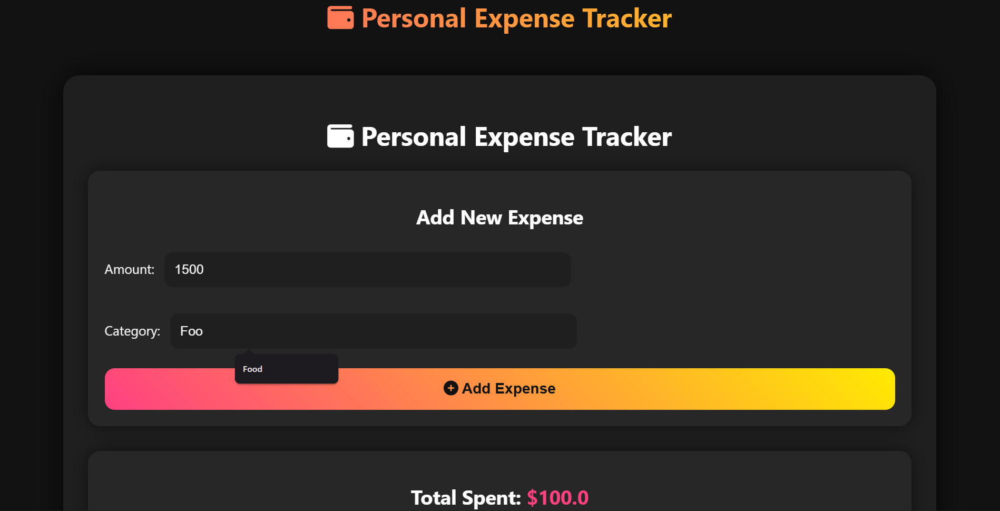

# 💸 Personal Expense Tracker (Django)


---

## 🌟 Features

✨ **Add Expenses** – Quickly log your expenses with category and amount.  
📊 **View Total Spending** – Track how much you’ve spent overall.  
📈 **Charts & Graphs** – Interactive charts for spending by category & over time using Chart.js.  
🎨 **Animated Frontend** – Lively UI with Animate.css & Font Awesome icons for a smooth, interactive experience.  
💡 **Responsive Design** – Works beautifully on mobile, tablet, and desktop.  

---

## 🚀 Tech Stack

| Layer       | Technology |
|------------|------------|
| Backend    | Django     |
| Frontend   | HTML, CSS, Animate.css, Font Awesome, Chart.js |
| Database   | SQLite     |

---

## 🖥️ Demo Screenshot

  
*Interactive charts & animated icons in action!*  

---

## ⚡ Setup Instructions

1. **Clone the repository**
```bash
git clone https://github.com/srimichael20/personal-expense-tracker.git
cd personal-expense-tracker


